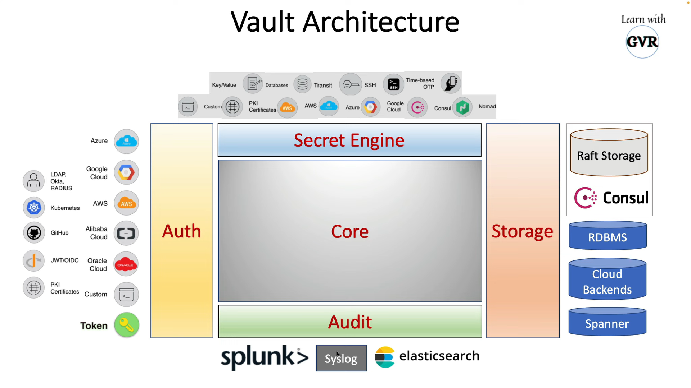

# Vault

Centralized Secrets & encryption management system
idenity based
gated by authentication and authorization methods

## Types of Secrets

1. Passwords
2. PKI (Public Key Infrastructure) Certificates
3. SSH Keys
4. Key Value
5. Encryption Keys
6. Time-Based OTP
7. TLS Certs ..etc

## Features

### Secure Secret Storage
1. Internal (local or consul)
2. External (AWS,Azure,GCP)

### Dynamic Secrets
1. Secrets on-demand for AWS
2. TOTP - Revoke after that

### Data Encryption
1. Encrypt & Decrypt data without storing it
2. Creation encryption keys

### Leasing & Renewal
1. Lease - allow & revokes the secret
2. Renew - the secret

### Revocation
1. Revoke secrets
2. Based on bulk, users, type

## Use Cases:

1. General Secret Storage
    Store it &
    Read in plain text - Support Audit

2. Enployee Credentials Storage
    Manage employee credentials
    Create, Rollout, Manage, revoke etc

3. API Key Generation for scripts
    Ideal for scripts - dynamic
    AWS, Azure, GCP - access & IAM

4. Data Encryption
    encrypt/decrypt of somewhere data
    Worry free encryption

5. Automated PKI Infrastructure
    Creating , rotating and managing certificates

## Vault Architecture

